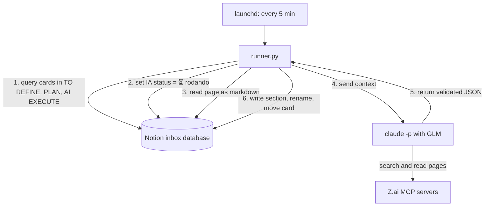

# clarify-pipeline-runner

A human-in-the-loop orchestrator that turns a Notion Kanban board into an AI task pipeline. A scheduled Python runner watches the board and, for each stage (refine, plan, execute), runs headless Claude Code, powered by GLM, as the agent. The result is written back to the card page.


## Problem

Capturing items in a Notion inbox is easy. Processing them is not: items stay in the backlog because there is no consistent step to clarify, plan, and execute them. Part of that work (research, summaries, message drafts) can be done by an AI. This program does that work with the quota of a GLM Coding Plan that is already paid, so there is no extra cost.

## How it works

1. `launchd` (the macOS task scheduler) starts `runner.py` every 5 minutes.
2. The runner queries the Notion database through the Notion API and picks at most 3 cards in the columns `TO REFINE`, `PLAN`, and `AI EXECUTE`.
3. The runner sets `IA status = ⏳ rodando` on each card. This lock prevents the same card from being processed twice.
4. The runner reads the card page as markdown and sends it to Claude Code.
5. Claude Code runs with the GLM model through the Z.ai endpoint. It can search the web and read pages. It returns a JSON object with the section text, a new title, a status, and a suggested executor.
6. The runner validates the JSON, writes the section on the page, updates the properties, and moves the card to the next column.



The board state (which cards run, locks, errors, moves) is controlled by tested Python code, not by the AI. Reasons: polling the board through the API costs no tokens, the AI cannot mark its own failure, and the state rules are covered by unit tests.

## Quick start

Requires the setup described in [docs/setup.md](docs/setup.md).

```bash
cd ~/clarify-pipeline-runner
.venv/bin/pytest -q                            # run the unit tests
.venv/bin/python runner.py --dry-run           # list the cards that would run, write nothing
.venv/bin/python runner.py --page CARD_ID      # process one card only
.venv/bin/python runner.py                     # full run: up to 3 cards
tail -f logs/runner.log                        # follow the log
```

## Project structure

```txt
clarify-pipeline-runner/
  runner.py            # entry point: lock, fetch cards, process, log
  config.py            # constants: API version, limits, paths, property names, stages
  items.py             # board rules: card selection, next column, property values (pure functions)
  page_writer.py       # markdown written on the page (pure functions)
  notion_api.py        # HTTP calls to the Notion API, with retries
  claude_runner.py     # builds the Claude Code command, runs it, validates the answer
  output_schema.json   # required format of the Claude answer
  requirements.txt     # pinned Python dependencies
  .env.example         # template for .env
  prompts/             # AI instructions: base.md, refine.md, plan.md, execute.md
  launchd/             # launchd job template (every 300 s)
  tests/               # pytest tests and recorded real responses (fixtures)

  Created at setup or at runtime (git-ignored):
  .env                 # secrets: NOTION_TOKEN, GLM_API_KEY, NOTION_DATA_SOURCE_ID
  .venv/               # Python virtual environment
  run/                 # mcp.json (generated) and runner.lock
  workspace/           # empty folder where Claude Code runs
  logs/                # runner.log and one raw Claude output per call in logs/runs/
```

Pure functions only transform data and never touch the network or the disk. All board rules live in pure functions, so they are tested without network access.

## Stack

- Python 3.14, `httpx`, `python-dotenv`, `jsonschema`, `pytest`
- Notion API version `2026-03-11` (data sources and markdown endpoints)
- Claude Code CLI in headless mode, pointed at the Z.ai Anthropic-compatible endpoint
- GLM models from the GLM Coding Plan
- Z.ai Web Search and Web Reader MCP servers
- macOS `launchd`

## Documentation

The documentation is in Portuguese.

| Question | File |
| --- | --- |
| What does each column do? | [docs/how-it-works.md](docs/how-it-works.md) |
| Which files exist and why is it designed this way? | [docs/architecture.md](docs/architecture.md) |
| How do I install it from scratch? | [docs/setup.md](docs/setup.md) |
| How do I run it, read logs, and fix a card with an error? | [docs/operations.md](docs/operations.md) |
| What is done and what is next? | [docs/roadmap.md](docs/roadmap.md) |

## Status

Pilot in progress. The Refine stage works end to end with real cards. See [docs/roadmap.md](docs/roadmap.md).
